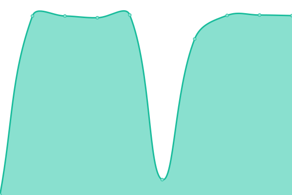
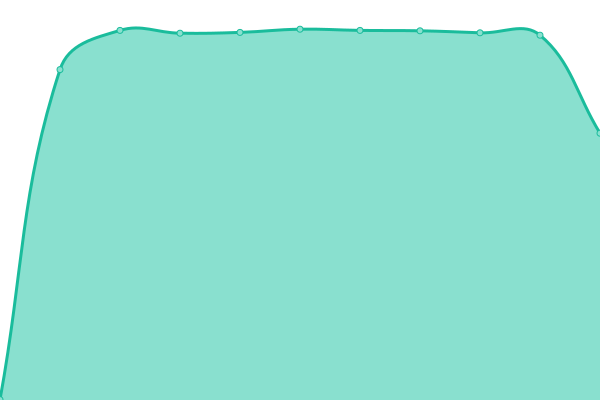

# [📈 Live Status](https://status.ayla-app.org): <!--live status--> **🟧 Partial outage**

This repository contains the open-source uptime monitor and status page for [Upptime](https://upptime.js.org), powered by [Upptime](https://github.com/upptime/upptime).

With [Upptime](https://upptime.js.org), you can get your own unlimited and free uptime monitor and status page, powered entirely by a GitHub repository. We use [Issues](https://github.com/upptime/upptime/issues) as incident reports, [Actions](https://github.com/AylaAI/status-monitor-upptime/actions) as uptime monitors, and [Pages](https://status.ayla-app.org) for the status page.

<!--start: status pages-->
<!-- This summary is generated by Upptime (https://github.com/upptime/upptime) -->
<!-- Do not edit this manually, your changes will be overwritten -->
<!-- prettier-ignore -->
| URL | Status | History | Response Time | Uptime |
| --- | ------ | ------- | ------------- | ------ |
|  Redis Service | 🟩 Up | [redis-service.yml](https://github.com/AylaAI/status-monitor-upptime/commits/HEAD/history/redis-service.yml) | 

 1494ms
     
 | 

<a href="https://status.ayla-app.org/history/redis-service">98.80%</a>
    

|  Milvus Service | 🟩 Up | [milvus-service.yml](https://github.com/AylaAI/status-monitor-upptime/commits/HEAD/history/milvus-service.yml) | 

 874ms
     
 | 

<a href="https://status.ayla-app.org/history/milvus-service">98.80%</a>
    

|  MongoDB Service | 🟩 Up | [mongo-db-service.yml](https://github.com/AylaAI/status-monitor-upptime/commits/HEAD/history/mongo-db-service.yml) | 

 826ms
     
 | 

<a href="https://status.ayla-app.org/history/mongo-db-service">98.80%</a>
    

|  API Server | 🟩 Up | [api-server.yml](https://github.com/AylaAI/status-monitor-upptime/commits/HEAD/history/api-server.yml) | 

 783ms
     
 | 

<a href="https://status.ayla-app.org/history/api-server">98.80%</a>
    

|  Audio Server | 🟩 Up | [audio-server.yml](https://github.com/AylaAI/status-monitor-upptime/commits/HEAD/history/audio-server.yml) | 

 743ms
     
 | 

<a href="https://status.ayla-app.org/history/audio-server">98.80%</a>
    

|  Chatbot Server | 🟩 Up | [chatbot-server.yml](https://github.com/AylaAI/status-monitor-upptime/commits/HEAD/history/chatbot-server.yml) | 

 867ms
     
 | 

<a href="https://status.ayla-app.org/history/chatbot-server">98.80%</a>
    

|  TTS Server | 🟩 Up | [tts-server.yml](https://github.com/AylaAI/status-monitor-upptime/commits/HEAD/history/tts-server.yml) | 

 757ms
     
 | 

<a href="https://status.ayla-app.org/history/tts-server">98.80%</a>
    

|  Conversation Cron Task | 🟩 Up | [conversation-cron-task.yml](https://github.com/AylaAI/status-monitor-upptime/commits/HEAD/history/conversation-cron-task.yml) | 

 734ms
     
 | 

<a href="https://status.ayla-app.org/history/conversation-cron-task">94.79%</a>
    

|  VisitAssist Phone Recording Pull Cron | 🟥 Down | [visit-assist-phone-recording-pull-cron.yml](https://github.com/AylaAI/status-monitor-upptime/commits/HEAD/history/visit-assist-phone-recording-pull-cron.yml) | 

 776ms
     
 | 

<a href="https://status.ayla-app.org/history/visit-assist-phone-recording-pull-cron">0.00%</a>
    

|  VisitAssist Summary Cron | 🟥 Down | [visit-assist-summary-cron.yml](https://github.com/AylaAI/status-monitor-upptime/commits/HEAD/history/visit-assist-summary-cron.yml) | 

 882ms
     
 | 

<a href="https://status.ayla-app.org/history/visit-assist-summary-cron">0.00%</a>
    

|  CareNote Cron | 🟥 Down | [care-note-cron.yml](https://github.com/AylaAI/status-monitor-upptime/commits/HEAD/history/care-note-cron.yml) | 

 884ms
     
 | 

<a href="https://status.ayla-app.org/history/care-note-cron">0.00%</a>
    

|  Email Ingestion Pull Cron | 🟩 Up | [email-ingestion-pull-cron.yml](https://github.com/AylaAI/status-monitor-upptime/commits/HEAD/history/email-ingestion-pull-cron.yml) | 

 911ms
     
 | 

<a href="https://status.ayla-app.org/history/email-ingestion-pull-cron">98.80%</a>
    

<!--end: status pages-->

[**Visit our status website →**](https://status.ayla-app.org)

## Manually Adding Issues

You can manually create a Github Issue to show it on the dashboard. Useful for acknowledging known outages, planned downtime, etc.
To do this, you **must add the `status` label** to the issue.
Alternatively, you can use an issue template.

## 📄 License

- Powered by: [Upptime](https://github.com/upptime/upptime)
- Code: [MIT](./LICENSE) © [Anand Chowdhary](https://anandchowdhary.com), supported by [Pabio](https://pabio.com)
- Data in the `./history` directory: [Open Database License](https://opendatacommons.org/licenses/odbl/1-0/)
